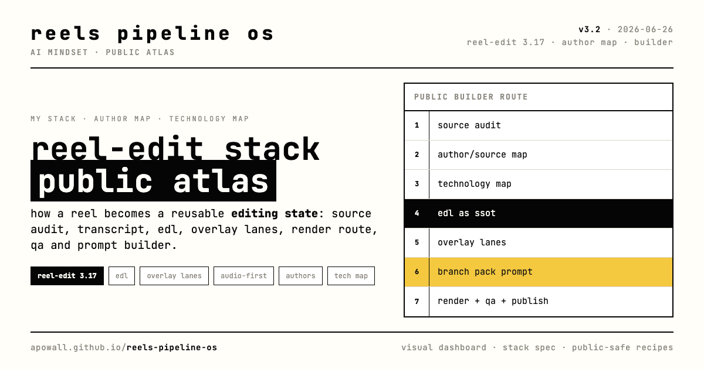

# AI Mindset Reels Pipeline

> **Open community stack for agentic short-form (Reels) editing.**
> Live: https://apowall.github.io/reel-stack-compare/

Not one "correct" pipeline — a stack you **fork, adapt, and contribute back to**. Born inside **AI Mindset {space}** as a format called *stack compare*: set your montage contour next to someone else's and steal the best parts.



## Start here

| file | what |
|------|------|
| **[STACK.md](STACK.md)** | the whole stack — every layer, tools, contracts, EDL schema, the skills, how to run it. Download this. |
| **[CONTRIBUTING.md](CONTRIBUTING.md)** | how to add your branch / example / improvement (+ the no-personal-data rule) |
| **[index.html](index.html)** | the live dashboard (single static file) |

## The dashboard (6 tabs)

| tab | shows |
|-----|-------|
| **сравнение** | our reels block editor vs Max Postnikov's long-form YouTube cut-chain, layer by layer |
| **короткий формат** | Max's pipeline ported to short-form vs our short-form answer + 2026 KPIs |
| **живой пример** | a sanitized worked recipe: source blocks → EDL strip → overlay lanes → QA → branch surface |
| **заимствуем** | six borrows ranked by leverage + our moat |
| **развитие** | target merged architecture + roadmap |
| **технологии** | EXA-researched technology matrix (Remotion, OTIO, Hyperframes, X-Cut, Scribe, …) |

Keyboard: `1`–`6` switch tabs · `d` toggle dark/light.

## The idea in one line

A short-form editor should store the **recipe** — source blocks + EDL + overlay lanes + QA/audio — not just the final mp4. Then a style can be pinned, reproduced, and **forked by anyone**.

## Branches so far

- **max postnikov** — long-form YouTube cut-chain (the first comparison)
- **our reels** — visual block editor, mode/style library, audio-first lip-sync
- **answer-card** — a sanitized worked recipe-example (overlay density ladder: clean → captions → micro → low-rail → soft-card)
- **your branch** — next. See [CONTRIBUTING.md](CONTRIBUTING.md).

## Fork the dashboard as your own comparison

One `index.html`, no build step. Copy it, edit the header/thesis and the two pipeline columns, keep the Shaper design tokens (`:root` block — pure B&W, JetBrains Mono, 1px frames). Regenerate the social cover from `assets/og-cover.src.html`.

## Publish your own

```bash
gh repo create <you>/<name> --public --source=. --push
gh api -X POST repos/<you>/<name>/pages -f 'source[branch]=main' -f 'source[path]=/'
```

---

Built with Claude Code + Codex via EXA MCP. Aesthetic: AI Mindset Shaper. **No personal data in public artifacts — mechanics only.**
